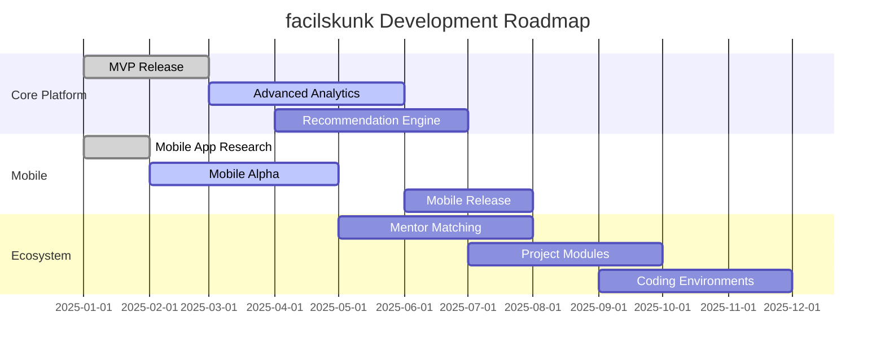

# facilskunk

<div align="center">


assets/FACILISKUNK.jpeg

[](https://github.com/skunkworks-io/facilskunk/blob/main/LICENSE)
[](https://github.com/skunkworks-io/facilskunk/issues)
[](https://github.com/skunkworks-io/facilskunk/actions)
[](https://codecov.io/gh/skunkworks-io/facilskunk)
[](https://www.npmjs.com/package/facilskunk)

**Your personalized AI learning journey starts here**

[Demo](https://facilskunk.io) • [Documentation](https://docs.facilskunk.io) • [Community](https://community.facilskunk.io) • [Support](https://facilskunk.io/support)

</div>

---

## 🚀 Value Proposition

facilskunk transforms the complex landscape of AI education into accessible, personalized learning paths. We help bridge the gap between theoretical knowledge and practical implementation by offering:

- **Structured Learning**: Navigate the AI field with clear, step-by-step guidance tailored to your background
- **Resource Optimization**: Save hundreds of hours sifting through scattered online resources
- **Skill Validation**: Verify your progress with practical assessments aligned with industry requirements
- **Community Support**: Connect with peers and mentors facing similar learning challenges

> "facilskunk reduced my AI learning curve from years to months by providing exactly what I needed when I needed it." — Early Beta User

## 🔭 Vision & Growth

| Year | Projected User Base | Major Milestones |
|------|---------------------|------------------|
| 2025 | 50,000+ | Platform launch, initial resource library |
| 2026 | 250,000+ | Mobile app release, mentor network |
| 2027 | 750,000+ | Enterprise solutions, partnership program |
| 2028 | 2M+ | International expansion, certification program |
| 2030 | 5M+ | AI education ecosystem, industry standard certification |

---

## 📋 Overview

facilskunk is a comprehensive platform designed to help users create personalized learning paths for artificial intelligence education. It provides structured guidance, curated resources, and interactive planning tools to facilitate effective AI learning journeys.

## ✨ Features

<table>
  <tr>
    <td width="50%">
      <h3>🧠 Personalized Learning Paths</h3>
      <p>Create customized learning plans based on your background, goals, and available time</p>
    </td>
    <td width="50%">
      <h3>📚 Resource Curation</h3>
      <p>Access carefully selected tutorials, courses, books, and other materials organized by skill level and topic</p>
    </td>
  </tr>
  <tr>
    <td width="50%">
      <h3>📊 Progress Tracking</h3>
      <p>Monitor your advancement through interactive checkpoints and milestones</p>
    </td>
    <td width="50%">
      <h3>👥 Community Integration</h3>
      <p>Connect with other learners and participate in group learning activities</p>
    </td>
  </tr>
  <tr>
    <td width="50%">
      <h3>🔍 Adaptive Recommendations</h3>
      <p>Receive suggestions for next steps based on your progress and feedback</p>
    </td>
    <td width="50%">
      <h3>🔗 Industry Alignment</h3>
      <p>Learning paths aligned with current industry needs and job requirements</p>
    </td>
  </tr>
</table>

## 🚀 Getting Started

### Prerequisites

- Node.js (v14 or higher)
- npm or yarn
- MongoDB (local or Atlas connection)

### Installation

1. Clone this repository:
   ```bash
   git clone https://github.com/skunkworks-io/facilskunk.git
   ```

2. Install dependencies:
   ```bash
   cd facilskunk
   npm install
   ```

3. Configure environment:
   ```bash
   cp .env.example .env
   # Edit .env with your configuration
   ```

4. Run the application:
   ```bash
   npm start
   ```

5. Visit `http://localhost:3000` in your browser

## 📖 Usage Guide

### Creating Your Learning Plan

<details>
<summary>Step-by-step process</summary>

1. Complete the initial assessment to identify your current knowledge level
2. Define your learning goals and time commitment
3. Review and customize the generated learning path
4. Begin your journey with the first recommended resource

</details>

### Tracking Progress

<details>
<summary>Monitoring your advancement</summary>

- Mark completed sections in your learning plan
- Take periodic assessments to measure knowledge retention
- Adjust your plan based on progress and changing interests

</details>

## 🔧 Resource Categories

| Category | Description | Example Resources |
|----------|-------------|-------------------|
| **Fundamentals** | Machine Learning basics | Stanford ML Course, Mathematics for ML |
| **Deep Learning** | Neural network architectures | fast.ai, Deep Learning Book |
| **NLP** | Natural Language Processing | Hugging Face tutorials, NLP Specialization |
| **Computer Vision** | Image/video analysis | PyTorch Vision tutorials, OpenCV projects |
| **RL** | Reinforcement Learning | Sutton & Barto book, OpenAI Gym |
| **Ethics** | Responsible AI development | Ethics in AI courses, case studies |
| **Projects** | Practical implementations | Guided project templates, collaboration tools |

## 🛠️ Contributing

We welcome contributions to improve facilskunk! Please follow these steps:

1. Fork the repository
2. Create a feature branch: `git checkout -b feature-name`
3. Commit your changes: `git commit -m 'Add some feature'`
4. Push to the branch: `git push origin feature-name`
5. Submit a pull request

Please read our [Contributing Guide](CONTRIBUTING.md) for more details.

## 🗺️ Roadmap

<div align="center">



</div>

## 📄 License

This project is licensed under the MIT License - see the [LICENSE](LICENSE) file for details.

## 📞 Contact

For questions or feedback, please open an issue or contact the skunkworks-io team directly at support@facilskunk.io.

---

<div align="center">

**[⬆ back to top](#facilskunk)**

*facilskunk: Transforming how AI skills are learned and mastered*

</div>
