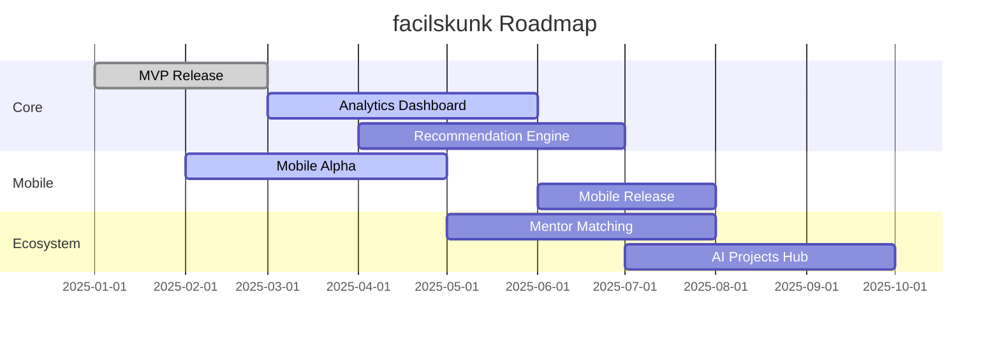

# facilskunk

<div align="center">


[](https://github.com/skunkworks-io/facilskunk/blob/main/LICENSE)
[](https://github.com/skunkworks-io/facilskunk/issues)
[](https://github.com/skunkworks-io/facilskunk/actions)
[](https://codecov.io/gh/skunkworks-io/facilskunk)
[](https://www.npmjs.com/package/facilskunk)

**Your personalized AI learning journey starts here**

[Demo](https://facilskunk.io) • [Documentation](https://docs.facilskunk.io) • [Community](https://community.facilskunk.io) • [Support](https://facilskunk.io/support)

</div>

---

## 🚀 Value Proposition

facilskunk transforms the complex landscape of AI education into accessible, personalized learning paths. We help bridge the gap between theory and practical implementation by offering:

- **Structured Learning** – Step-by-step guidance tailored to your background and goals
- **Resource Optimization** – Save time with curated learning materials selected by experts
- **Skill Validation** – Verify knowledge through practical assessments and projects
- **Community Support** – Engage with peers and mentors in a collaborative environment

> _"facilskunk reduced my AI learning curve from years to months by providing exactly what I needed when I needed it."_ — Early Beta User

## 🔭 Vision & Growth

| Year | Projected Users | Major Milestones |
|------|----------------|------------------|
| 2025 | 50,000+ | Platform launch, AI resource library completion |
| 2026 | 250,000+ | Mobile app release, mentor network expansion |
| 2027 | 750,000+ | Enterprise AI solutions, certification programs |
| 2030 | 5M+ | Global AI education ecosystem with industry partnerships |

---

## 📋 Overview

facilskunk is an AI learning platform that provides personalized learning paths, curated resources, and interactive tools for structured learning. Our adaptive system guides learners from fundamentals to advanced topics based on individual goals, background, and learning pace.

<div align="center">
  
  
  
</div>

## ✨ Features

| Feature | Description |
|---------|------------|
| **🧠 Personalized Paths** | Create learning plans tailored to your goals, background, and available time |
| **📚 Curated Resources** | Handpicked AI tutorials, courses, and projects vetted by industry experts |
| **📊 Progress Tracking** | Monitor learning milestones, retention, and skill development over time |
| **👥 Community** | Join study groups, connect with mentors, and participate in collaborative projects |
| **🔍 Adaptive Recommendations** | AI-driven course suggestions that evolve with your learning progress |
| **🛠️ Hands-On Projects** | Apply knowledge with real-world projects matched to your skill level |

## 🚀 Getting Started

### Prerequisites

- **Node.js** (v14 or higher)
- **npm** (v7+) or **yarn** (v1.22+)
- **MongoDB** (local or Atlas connection)
- **Modern web browser** (Chrome, Firefox, Safari, Edge)

### Installation

1. **Clone this repository:**
   ```bash
   git clone https://github.com/skunkworks-io/facilskunk.git
   ```

2. **Install dependencies:**
   ```bash
   cd facilskunk
   npm install
   ```

3. **Configure environment:**
   ```bash
   cp .env.example .env
   # Edit .env with your configuration details (MongoDB URI, API keys)
   ```

4. **Run the application:**
   ```bash
   npm start
   ```
   You should see output like:
   ```
   🚀 Server running on http://localhost:3000
   📊 MongoDB connected successfully
   ```

5. **Visit [http://localhost:3000](http://localhost:3000) in your browser**
   
   The welcome screen should appear, prompting you to create an account or sign in.

<div align="center">
  
  
  
</div>

## 📖 Usage Guide

### 🎯 Creating Your Learning Plan

1. **Take an initial assessment** to evaluate your current knowledge
2. **Define your AI learning goals** (research, development, implementation)
3. **Review and customize** the generated learning path
4. **Start with your first recommended resource** with estimated completion time

### 📊 Tracking Progress

- Mark completed sections to track your journey
- Take assessments to measure retention and understanding
- Receive performance insights and gap analysis
- Adjust learning paths based on performance and feedback

## 🔧 Learning Categories

| Category | Description | Example Resources |
|----------|-------------|-------------------|
| **AI Fundamentals** | Basics of ML/DL concepts | Stanford ML, Fast.ai, Elements of AI |
| **Deep Learning** | Neural Networks architecture and implementation | PyTorch, TensorFlow, Deep Learning Specialization |
| **NLP** | Natural Language Processing | Hugging Face, NLP Specialization, spaCy course |
| **Computer Vision** | Image and video AI | OpenCV, YOLO, Computer Vision Nanodegree |
| **Reinforcement Learning** | AI decision-making algorithms | Sutton & Barto RL, Deep RL Nanodegree |
| **Ethics & Bias** | Responsible AI development | AI ethics courses, Fairness in ML |
| **MLOps** | Deployment and scaling | MLOps Specialization, Full-Stack Deep Learning |

## 🛠️ Contributing

We welcome contributions from the community! Follow these steps:

1. **Fork the repository**
2. **Create a feature branch:**
   ```bash
   git checkout -b feature/amazing-improvement
   ```
3. **Commit your changes:**
   ```bash
   git commit -m 'Add amazing improvement'
   ```
4. **Push to your branch:**
   ```bash
   git push origin feature/amazing-improvement
   ```
5. **Submit a pull request**

Refer to our [Contributing Guide](CONTRIBUTING.md) for detailed development guidelines, code standards, and review process.

## 🗺️ Roadmap



## 📄 License

This project is licensed under the MIT License - see [LICENSE](LICENSE) file for details.

## 📞 Contact

- **Email**: support@facilskunk.io
- **GitHub Issues**: [Report Issues](https://github.com/skunkworks-io/facilskunk/issues)
- **Twitter**: [@facilskunk](https://twitter.com/facilskunk)
- **Discord**: [Join our community](https://discord.gg/facilskunk)

<div align="center">

[⬆ Back to Top](#facilskunk)

**facilskunk**: Transforming how AI skills are learned and mastered

</div>